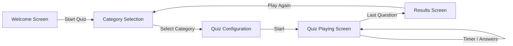
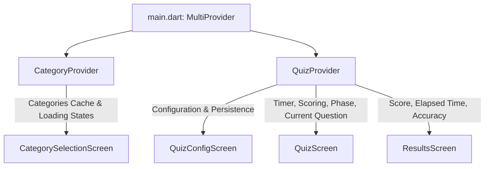

# 🧠 Quizzical — Flutter Trivia & Quiz App

[](https://flutter.dev)
[](https://dart.dev)
[](https://pub.dev/packages/provider)
[](https://opentdb.com/)
[](https://m3.material.io/)
[](LICENSE)

**Quizzical** is a modern, responsive, and feature-packed Flutter quiz application powered by the [Open Trivia Database (OpenTDB)](https://opentdb.com/) REST API. Built with clean architecture principles and the **Provider** state management pattern, Quizzical offers an engaging trivia experience with dynamic categories, customizable quiz configurations, real-time countdown timers, interactive answer reveals, score tracking, and persistent user preferences.

---

## 📑 Table of Contents

- [✨ Key Features](#-key-features)
- [📱 App Walkthrough & User Flow](#-app-walkthrough--user-flow)
- [🏗️ Architecture & Project Structure](#️-architecture--project-structure)
- [🎨 Design System & Theme](#-design-system--theme)
- [🌐 API Integration (OpenTDB)](#-api-integration-opentdb)
- [⚙️ State Management (Provider)](#️-state-management-provider)
- [💾 Local Persistence (SharedPreferences)](#-local-persistence-sharedpreferences)
- [🚀 Getting Started](#-getting-started)
  - [Prerequisites](#prerequisites)
  - [Installation & Setup](#installation--setup)
  - [Running the App](#running-the-app)
- [🔧 Configuration & Customization](#-configuration--customization)
- [📦 Key Dependencies](#-key-dependencies)
- [👨‍💻 Author & Acknowledgments](#-author--acknowledgments)

---

## ✨ Key Features

- **🌐 Live Trivia Categories**: Fetches 20+ trivia categories directly from the Open Trivia Database API (e.g., General Knowledge, Science & Nature, Computers, History, Film, Music, Sports, Anime, and more).
- **🎨 Dynamic Pastel Category Cards**: Each category is paired with custom pastel aesthetics and context-aware category icons (books, controllers, science beakers, globe, etc.).
- **⚙️ Deep Quiz Customization**:
  - **Question Count**: Adjustable slider (1 to 50 questions, default 10).
  - **Difficulty Filter**: Any, Easy, Medium, or Hard.
  - **Question Type**: Multiple Choice (4 choices) or True / False (boolean).
- **⏱️ Real-time 30-Second Question Timer**:
  - Visual countdown timer per question.
  - Visual color alerts (transitions to red when $\le 5$ seconds remain).
  - Auto-timeout handling: reveals correct answer automatically and advances smoothly.
- **🎯 Instant Interactive Feedback**:
  - Highlights correct answers in soothing mint green (`#B2DFDB`).
  - Highlights wrong selections in coral red (`#FFA1A1`) while revealing the correct answer.
  - Randomized answer positions with HTML entity decoding (e.g., `&quot;`, `&#039;`).
- **📊 Comprehensive Results & Performance Analytics**:
  - Accuracy percentage calculation with responsive badge colors (green for $\ge 70\%$, orange for $< 70\%$).
  - Elapsed total quiz session time formatted in minutes and seconds (`Xm Ys`).
  - Motivational messages tailored to performance with an instant "Play Again" flow.
- **🛡️ Progress Safeguards & Confirmation**:
  - Mid-quiz confirmation dialog to prevent accidental exits and loss of progress.
- **💾 Preference Persistence**:
  - Saves your last chosen question amount, difficulty, question type, and category via `SharedPreferences`.
- **🔄 Robust Error Handling & Skeletons**:
  - Custom skeleton loading states for category grids and quiz questions.
  - Inline retry banners for network drops or API rate limit issues.
- **📱 Responsive & Cross-Platform**:
  - Adaptive column layouts supporting phones, tablets, and desktop/web widths.

---

## 📱 App Walkthrough & User Flow



### 1. Welcome Screen (`WelcomeScreen`)
- Displays playful illustrated vector art with decorative geometric accents.
- Displays app branding **Quizzical** alongside the student/creator name.
- Primary **"START QUIZ"** action button launching category exploration.

### 2. Category Selection Screen (`CategorySelectionScreen`)
- Automatically loads categories from OpenTDB with in-memory caching to avoid redundant requests.
- Grid view with pastel-tinted cards and domain-specific icons.
- Skeleton placeholder shimmer effect during initial network requests.
- Non-intrusive retry banner if network connectivity is lost.

### 3. Quiz Configuration Screen (`QuizConfigScreen`)
- Fine-tune your trivia experience:
  - **Amount Slider**: 1 to 50 questions.
  - **Difficulty Dropdown**: Any, Easy, Medium, Hard.
  - **Type Dropdown**: Multiple Choice or True / False.
- Automatically saves selected parameters for future sessions.
- Displays a dedicated loading skeleton while fetching and assembling questions.

### 4. Quiz Screen (`QuizScreen`)
- Header displaying current question indicator (`X / Total`), linear progress bar, live score counter, and remaining time.
- Question card with decoded HTML typography.
- Answer tiles with instant visual color response (correct, incorrect, or timeout state).
- "Next" / "See Results" action button for user-controlled pacing.
- Safety dialog on exit attempt.

### 5. Results Screen (`ResultsScreen`)
- Celebration icon & message for scores $\ge 70\%$, or encouraging workout icon for scores $< 70\%$.
- Score percentage badge with soft elevation shadow.
- Breakdown of correct answers and total time elapsed.
- "PLAY AGAIN" button resetting session state and returning to category selection.

---

## 🏗️ Architecture & Project Structure

The project follows a clean **MVVM-inspired layered architecture** utilizing Flutter's **Provider** pattern:

```
FlutterClassExam/
├── android/                      # Android native configuration
├── ios/                          # iOS native configuration
├── web/                          # Web configuration & assets
├── assets/                       # Static assets and screenshots
│   ├── logo.png                  # App icon / launcher logo
│   └── screenshots/              # UI screenshots
├── lib/
│   ├── main.dart                 # Application entry point & Provider registration
│   ├── app.dart                  # QuizzicalApp MaterialApp root & theme setup
│   ├── core/
│   │   ├── quiz_constants.dart   # App-wide constants (student name, timers, keys)
│   │   └── quiz_theme.dart       # Material 3 theme data, colors, typography
│   ├── models/
│   │   ├── trivia_category.dart  # TriviaCategory model with JSON serialization
│   │   └── trivia_question.dart  # TriviaQuestion model with HTML entity decoding
│   ├── services/
│   │   └── opentdb_service.dart  # OpenTDB REST API client & error handling
│   ├── providers/
│   │   ├── category_provider.dart# State management for category fetching & caching
│   │   └── quiz_provider.dart    # State management for active quiz, timer & scoring
│   ├── ui/
│   │   ├── screens/
│   │   │   ├── welcome_screen.dart           # Intro screen with branding
│   │   │   ├── category_selection_screen.dart# Category grid screen
│   │   │   ├── quiz_config_screen.dart       # Filters and quiz settings screen
│   │   │   ├── quiz_screen.dart              # Interactive quiz playing screen
│   │   │   └── results_screen.dart           # Final score and stats screen
│   │   └── widgets/
│   │       └── quiz_widgets.dart             # RetryBanner, CategorySkeletonGrid, QuizLoadingSkeleton
│   └── ...
├── pubspec.yaml                  # Project dependencies and asset definitions
└── README.md                     # Project documentation
```

---

## 🎨 Design System & Theme

Quizzical implements a customized **Material 3** theme with bespoke color tokens and typography from **Google Fonts**:

### 🎨 Color Palette

| Token | Hex | Preview | Description |
|---|---|---|---|
| `kQuizPrimary` | `#00695C` |  | Deep Teal (Brand Primary) |
| `kQuizPrimaryDark` | `#004D40` |  | Dark Teal (Buttons & Accents) |
| `kQuizBg` | `#F2F2F2` |  | Light Canvas Background |
| `kQuizText` | `#37474F` |  | Slate Charcoal (Primary Text) |
| `kQuizCorrectBg` | `#B2DFDB` |  | Mint Green (Correct Answer Highlight) |
| `kQuizIncorrectBg` | `#FFA1A1` |  | Coral Pink (Incorrect Answer Highlight) |
| `kQuizScoreGood` | `#C8E6C9` |  | Soft Green (High Score Badge $\ge 70\%$) |
| `kQuizScoreBad` | `#FF7043` |  | Deep Orange (Low Score Badge $< 70\%$) |

### 🔤 Typography
- **Headings & Buttons**: `GoogleFonts.poppins` for clean, modern legibility.
- **Subtitles & Italic Accents**: `GoogleFonts.lora` for refined editorial contrast.

---

## 🌐 API Integration (OpenTDB)

The app integrates with the public **[Open Trivia Database](https://opentdb.com/api_config.php)**:

### Endpoints Used

1. **Fetch Categories**:
   ```http
   GET https://opentdb.com/api_category.php
   ```
   *Returns the full catalog of available trivia categories and IDs.*

2. **Fetch Questions**:
   ```http
   GET https://opentdb.com/api.php?amount={amount}&category={categoryId}&difficulty={difficulty}&type={type}
   ```
   *Query Parameters:*
   - `amount`: Number of questions requested (1–50).
   - `category`: Category ID (e.g., `9` for General Knowledge, `18` for Computers).
   - `difficulty`: `easy`, `medium`, or `hard` (omitted if 'any').
   - `type`: `multiple` or `boolean` (omitted if 'any').

### Robust HTML Entity Decoding
Trivia questions and answers from OpenTDB often contain HTML entities (e.g., `&quot;`, `&#039;`, `&amp;`, `&eacute;`). Quizzical includes a custom regex-based parser in [trivia_question.dart](file:///Users/mahmudulhasanniaze/FlutterClass/FlutterClassExam/lib/models/trivia_question.dart) supporting decimal (`&#NN;`), hexadecimal (`&#xHH;`), and standard named HTML entities.

---

## ⚙️ State Management (Provider)

Quizzical utilizes `provider` with `ChangeNotifier` for clean, decoupled state:



- **`CategoryProvider`**:
  - Handles `CategoryLoadState` (`initial`, `loading`, `loaded`, `error`).
  - In-memory caching: loads categories once per app run unless an explicit retry is requested.
- **`QuizProvider`**:
  - Handles `QuizPhase` (`idle`, `loading`, `playing`, `answered`, `finished`, `error`).
  - Controls 30s countdown timer via Dart's `Timer.periodic`.
  - Tracks score, selected answers, timeout events, and total time elapsed.
  - Automatically loads and persists configuration preferences.

---

## 💾 Local Persistence (SharedPreferences)

The app remembers user settings between app launches using `shared_preferences`:

| Preference Key | Type | Description | Default |
|---|---|---|---|
| `quiz_amount` | `int` | Number of questions per quiz | `10` |
| `quiz_difficulty`| `String` | Difficulty level (`any`, `easy`, `medium`, `hard`) | `'any'` |
| `quiz_type` | `String` | Question format (`multiple`, `boolean`) | `'multiple'` |
| `quiz_category_id` | `int` | Last chosen category ID | `null` |
| `quiz_category_name` | `String` | Last chosen category name | `''` |

---

## 🚀 Getting Started

### Prerequisites

Ensure you have the following installed on your machine:
- [Flutter SDK](https://docs.flutter.dev/get-started/install) (`^3.11.1` or higher)
- [Dart SDK](https://dart.dev/get-dart)
- An active emulator, simulator, or physical device (Android, iOS, macOS, Windows, Linux, or Web)

### Installation & Setup

1. **Clone the repository**:
   ```bash
   git clone https://github.com/Niaze-33/FlutterClassExam.git
   cd FlutterClassExam
   ```

2. **Install Flutter packages**:
   ```bash
   flutter pub get
   ```

3. **Verify Flutter setup**:
   ```bash
   flutter doctor
   ```

### Running the App

Run on your connected device or simulator:

```bash
# Auto-detect connected device
flutter run

# Run on Chrome (Web)
flutter run -d chrome

# Run on macOS Desktop
flutter run -d macos

# Run on iOS Simulator
flutter run -d ios

# Run on Android Emulator
flutter run -d android
```

---

## 🔧 Configuration & Customization

All primary quiz settings and student metadata are centralized in [lib/core/quiz_constants.dart](file:///Users/mahmudulhasanniaze/FlutterClass/FlutterClassExam/lib/core/quiz_constants.dart):

```dart
/// Shown under the Quizzical title on the welcome screen.
const String kStudentName = 'Imam Hosen';

/// Default and range settings for question counts
const int kDefaultQuestionAmount = 10;
const int kMinQuestionAmount = 1;
const int kMaxQuestionAmount = 50;

/// Question timer duration in seconds
const int kQuestionTimerSeconds = 30;
```

To customize:
1. Update `kStudentName` to display your preferred student or author name on the Welcome screen.
2. Adjust `kQuestionTimerSeconds` to increase or decrease the countdown time limit.
3. Modify the pastel color palette in [lib/core/quiz_theme.dart](file:///Users/mahmudulhasanniaze/FlutterClass/FlutterClassExam/lib/core/quiz_theme.dart) under `kCategoryPastels`.

---

## 📦 Key Dependencies

| Package | Version | Purpose |
|---|---|---|
| [`provider`](https://pub.dev/packages/provider) | `^6.1.5+1` | Reactive state management & dependency injection |
| [`http`](https://pub.dev/packages/http) | `^1.6.0` | HTTP requests to Open Trivia Database |
| [`shared_preferences`](https://pub.dev/packages/shared_preferences) | `^2.5.3` | Persistent local storage for quiz preferences |
| [`google_fonts`](https://pub.dev/packages/google_fonts) | `^6.2.1` | Typography (`Poppins` & `Lora`) |
| [`cached_network_image`](https://pub.dev/packages/cached_network_image) | `^3.4.1` | Network image loading and caching |
| [`iconsax`](https://pub.dev/packages/iconsax) | `^0.0.8` | Modern iconography |
| [`intl`](https://pub.dev/packages/intl) | `^0.20.3` | Date, time, and number formatting |

---

## 👨‍💻 Author & Acknowledgments

- **Developed for**: Flutter Class Exam / Project Submission
- **Student Name**: Imam Hosen
- **Data Source**: [Open Trivia Database (OpenTDB)](https://opentdb.com/)
- **Repository**: [GitHub — Niaze-33/FlutterClassExam](https://github.com/Niaze-33/FlutterClassExam)

---

<p align="center">
  Made with ❤️ and Flutter
</p>
